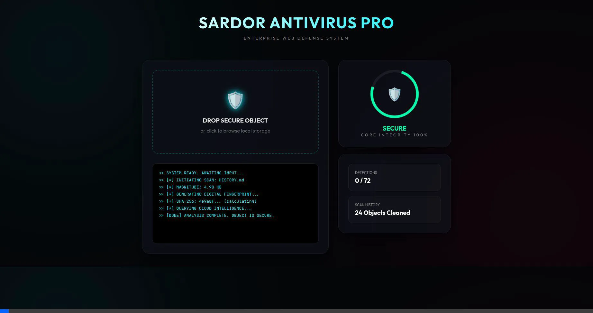
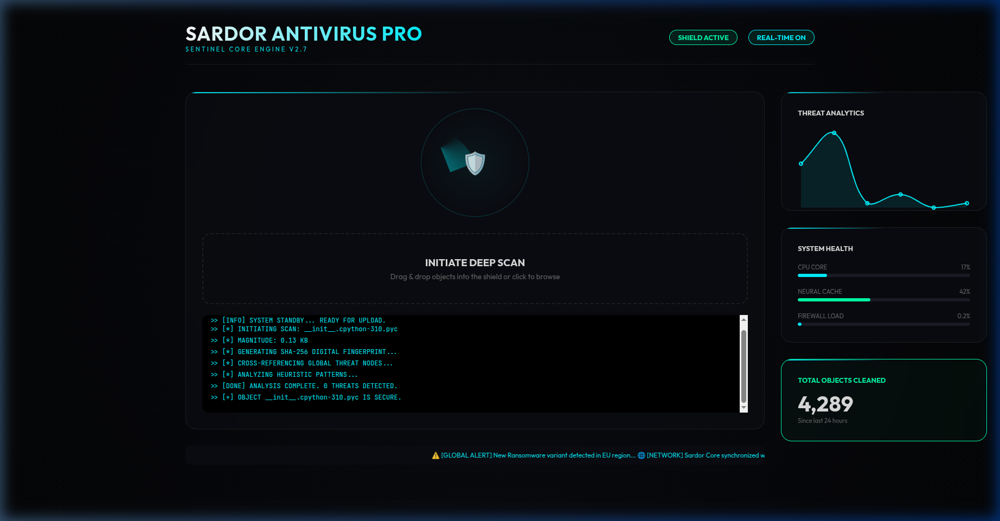

<div align="center">

# 🛡️ Sardor Antivirus Pro — Elite Shield

### Enterprise Cybersecurity · Real-Time Threat Detection · SOC Dashboard

<p align="center">
  
  
  
  
  
</p>

<p align="center">
  
  
  
  
</p>

<br/>

> **Enterprise-grade cybersecurity dashboard** with real-time radar scanning, heuristic threat analytics,
> VirusTotal & MetaDefender API integration, and a futuristic glassmorphism SOC interface.

<br/>

**[🚀 Quick Start](#-quick-start) · [📸 Screenshots](#-screenshots) · [🎥 Demo Video](#-demo-video) · [🏗️ Architecture](#-architecture) · [🤝 Contribute](#-contributing)**

</div>

---

## 🎥 Demo Video

[](https://github.com/builtbysardor/Antivirus-pro-)

> 📹 *Upload your demo recording to `screenshots/demo_video.webp` and embed it here:*
> ``

**Current demo recording (if available):**



---

## 📸 Screenshots

### 🖥️ Elite SOC Dashboard — Full Monitoring Console


> 💡 *Add more screenshots to the `screenshots/` folder and embed them here.*

---

## 💎 Features

| Feature | Description |
|---------|-------------|
| 📡 **Cyber-Radar System** | 360° deep heuristic scanning animation with visual integrity verification |
| 📊 **Real-Time Analytics** | Interactive threat intensity charts powered by Chart.js |
| 🛡️ **Shield Integrity Monitor** | Live monitoring of Neural Cache, CPU Core, and Firewall load |
| 🌐 **Global Threat Ticker** | Real-time global threat feeds and network alert stream |
| 📜 **Heuristic Logs** | Step-by-step transparency of every analysis cycle |
| 🔐 **SHA-256 Fingerprinting** | Cryptographic file fingerprinting for integrity checks |
| 🔗 **VirusTotal Integration** | Scan files & URLs against 70+ antivirus engines |
| 🔗 **MetaDefender Integration** | Multi-engine cloud scanning via MetaDefender API |
| 🎨 **Glassmorphism UI** | Futuristic frosted-glass cyberpunk dark interface |

---

## 🏗️ Architecture

```
┌─────────────────────────────────────────────────────────┐
│                      FRONTEND                           │
│           Vanilla JS · Modern CSS3 · Chart.js           │
│                                                         │
│  ├── Cyber-Radar Scanner    (Canvas animation)          │
│  ├── Threat Analytics       (Chart.js)                  │
│  ├── Shield Integrity       (live gauges)               │
│  ├── Global Threat Ticker   (live feed)                 │
│  └── Heuristic Log Viewer   (real-time stream)          │
└──────────────────────┬──────────────────────────────────┘
                       │ REST API (HTTP)
┌──────────────────────▼──────────────────────────────────┐
│                      BACKEND                            │
│       Python 3.12 · FastAPI · High-concurrency          │
│                                                         │
│  ├── /scan         — File & URL scanning endpoint       │
│  ├── /virustotal   — VirusTotal API integration         │
│  ├── /metadefender — MetaDefender API integration       │
│  └── /logs         — Heuristic analysis log stream      │
└──────────────────────┬──────────────────────────────────┘
                       │
┌──────────────────────▼──────────────────────────────────┐
│                   EXTERNAL APIs                         │
│            VirusTotal API · MetaDefender API            │
└─────────────────────────────────────────────────────────┘
```

---

## 🛠️ Tech Stack

| Layer | Technologies |
|-------|-------------|
| **Backend** | Python 3.12 · FastAPI · SHA-256 Fingerprinting |
| **APIs** | VirusTotal · MetaDefender |
| **Frontend** | Vanilla JS · Modern CSS3 · Chart.js |
| **Design** | Glassmorphism · Cyberpunk Dark Theme |

---

## 🚀 Quick Start

### Prerequisites
- Python 3.12+
- API keys: [VirusTotal](https://www.virustotal.com/gui/my-apikey) · [MetaDefender](https://metadefender.opswat.com/)

### Installation

```bash
# 1. Clone the repo
git clone https://github.com/builtbysardor/Antivirus-pro-.git
cd Antivirus-pro-

# 2. Install Python dependencies
pip install -r requirements.txt

# 3. Set your API keys
cp .env.example .env
# Edit .env with your VirusTotal & MetaDefender API keys

# 4. Start the backend
python backend/main.py
```

### Launch the UI

```bash
# Open the dashboard in your browser
open frontend/index.html
# or on Linux:
xdg-open frontend/index.html
```

The dashboard will be available at **http://localhost:8000** 🎉

---

## 📁 Project Structure

```
Antivirus-pro-/
├── backend/
│   └── main.py              # FastAPI server — scanning endpoints
├── frontend/
│   ├── index.html           # Dashboard UI entry point
│   ├── style.css            # Glassmorphism cyberpunk theme
│   └── app.js               # Radar animation & Chart.js logic
├── screenshots/
│   ├── demo_video.webp      # Live demo recording
│   └── elite_web_dashboard.png
├── requirements.txt
├── .env.example
└── README.md
```

---

## 🔮 Roadmap

- [ ] 🗂️ File upload scanning — drag & drop file analysis
- [ ] 📧 Email attachment scanner — EML file analysis
- [ ] 🐳 Docker deployment — one-command containerized setup
- [ ] 📱 Mobile responsive UI — on-the-go security monitoring
- [ ] 📊 Threat history database — SQLite-based scan history
- [ ] 🔔 Alert notifications — Telegram & email alerts on threats
- [ ] 🌍 Threat map — global IP geolocation visualization

---

## 🤝 Contributing

1. Fork the repo
2. Create your branch: `git checkout -b feature/amazing-feature`
3. Commit: `git commit -m 'Add amazing feature'`
4. Push: `git push origin feature/amazing-feature`
5. Open a Pull Request

---

## 📄 License

MIT License — see [LICENSE](LICENSE) for details.

---

<div align="center">

**Built with ❤️ by [Sardor](https://github.com/builtbysardor) · Samarkand, Uzbekistan 🇺🇿**

⭐ *Star this repo if it helped you — it means the world!*

</div>
